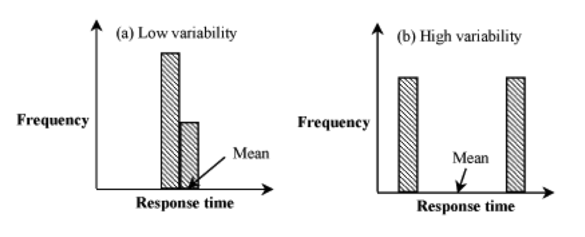

```{r setup, include=FALSE}
#knitr::opts_chunk$set(echo = FALSE)

library(dplyr)
library(emo)
library(ggplot2)
library(gridExtra)
library(knitr)
```

## Probabilidade vs. Estatística

- A **probabilidade** buscar prever a chance de eventos futuros ocorrerem
    - A **estatística** analisa a frequência de eventos passados

> - A **probabilidade** é um ramo da matemática teórica sobre consequências de definições
> - A **estatística** é matemática aplicada na busca de entender observações do mundo real


## Distribuições de variáveis aleatórias

- Variáveis Aleatórias (VAs) são funções numéricas onde valores possuem probabilidades

- A função densidade de probabilidade (*FDP*) mostra VAs (como histogramas)
    
```{r, echo=FALSE, fig.width=10, fig.height=4}
x1 <- data_frame(x = rnorm(1000, 7, 1))
x2 <- data.frame(x = rexp(1000, 0.1))
x3 <- data.frame(x = rweibull(1000, 50, 1))

d1 <- ggplot(x1, aes(x)) +
  geom_density(fill = 1) +
  ggtitle("FDP - Distribuição simétrica")

d2 <- ggplot(x2, aes(x)) +
  geom_density(fill = 1) +
  ggtitle("FDP - Inclinação positiva")

d3 <- ggplot(x3, aes(x)) +
  geom_density(fill = 1) +
  ggtitle("FDP - Inclinação negativa")

h1 <- ggplot(x1, aes(x)) +
  geom_histogram(bins = 30) +
  ggtitle("Histograma - Distribuição simétrica")

h2 <- ggplot(x2, aes(x)) +
  geom_histogram(bins = 30) +
  ggtitle("Histograma - Inclinação positiva")

h3 <- ggplot(x3, aes(x)) +
  geom_histogram(bins = 30) +
  ggtitle("Histograma - Inclinação negativa")

grid.arrange(d1, d2, d3, h1, h2, h3, nrow = 2)
```

## Distribuições de variáveis aleatórias

- Função Densidade Acumulada (FDA) é o somatório da FDP
    - FDA é a integral da FDP, enquanto a FDP é a derivada da FDA

$$C(X \leq k) = \sum_{x \leq k} P(X = x)$$

```{r, echo=FALSE, fig.width=9, fig.height=3}
df <- data.frame(x = rnorm(1000, 100, 20))

p1 <- ggplot(df, aes(x)) +
  geom_density() +
  ggtitle("Função Densidade de Probabilidade (FDP)")

p2 <- ggplot(df, aes(x)) +
  stat_ecdf() +
  ggtitle("Função Densidade Acumulada (FDA)")

grid.arrange(p1, p2, nrow = 1)
```

## Visualizando distribuições acumuladas

- As vendas de iPhone estão bombando?

<div align="center">

</div>

## O crescimento é mesmo significativo?

- Distribuições acumuladas podem dar uma visão errônea do crescimento
    - A mudança incremental é a derivada da FDA, que é difícil de visualizar

<div align="center">

</div>


## Estatística descritiva vs. inferencial

- **Estatística descritiva**: captura as propriedades e distribuição dos dados
    - *Medidas de tendência central* descrevem o centro de sua distribuição
    - *Medidas de variabilidade ou dispersão* descrevem o seu espalhamento
    
<br>

- **Estatística inferencial**: para tomar decisões e achar relações nos dados
    - Usa fundamentos e teorias da probabilidade
    - Preocupa-se em modelar fenômenos aleatórios
    - Exemplo: as diferenças nos dados entre duas situações podem ser atribuídas a diferenças reais ou ao acaso?

## Estatística descritiva

Objetivos: 

- Dar uma noção de como os dados estão distribuídos
- Entender melhor a natureza dos dados
- Identificar pontos anormais (possíveis outliers)
- Apresentação gráfica de aspectos importantes dos dados
- Identificar relações entre variáveis


# Sumarização de dados: medidas de centralidade

## Medidas de centralidade com número único

- Um número que seja representativo da maior parte dos dados

<br>

- Índices de tendência central (*average*) mais populares:
    - Média amostral
    - Mediana amostral
    - Moda amostral


## Medida de centralidade: média aritmética

- Soma dos valores $x$ dividido pelo número de observações $n$:

$$\mu_x = \frac{\sum_{i = 1}^{n} x_i}{n}$$

- Também chamado de primeiro momento da distribuição ou valor esperado
- A média é significativa para distribuições simétricas
    - Mas é sensível *outliers*, principalmente se a amostra é pequena
    
```{r, echo=FALSE, fig.width=10.5, fig.height=2.5}
h1_1 <- h1 +
  geom_vline(aes(xintercept = mean(x), col = "media"), size = 1, alpha= 0.6) + 
  theme(legend.title = element_blank(), legend.position = "top", title = element_blank())

h2_1 <- h2 +
  geom_vline(aes(xintercept = mean(x), col = "media"), size = 1, alpha= 0.6) + 
  theme(legend.title = element_blank(), legend.position = "top", title = element_blank())

h3_1 <- h3 +
  geom_vline(aes(xintercept = mean(x), col = "media"), size = 1, alpha= 0.6) + 
  theme(legend.title = element_blank(), legend.position = "top", title = element_blank())

grid.arrange(h1_1, h2_1, h3_1, nrow = 1)
```


## Medida de centralidade: mediana

- A mediana é o valor que divide os dados no meio (50-percentil ou 0.5-quantil)
    - Metade da massa de probabilidade está de um lado e de outro
    - É mais resistente a *outliers*, mas descarta muita informação
    
```{r, echo=FALSE, fig.width=10.5, fig.height=4}
h1_2 <- h1_1 +
  geom_vline(aes(xintercept = median(x), col = "mediana"), size = 1, alpha= 0.6)

h2_2 <- h2_1 +
  geom_vline(aes(xintercept = median(x), col = "mediana"), size = 1, alpha= 0.6)

h3_2 <- h3_1 +
  geom_vline(aes(xintercept = median(x), col = "mediana"), size = 1, alpha= 0.6)

c1_2 <- ggplot(x1, aes(x)) +
  stat_ecdf(size = 1) +
  geom_vline(aes(xintercept = mean(x), col = "media"), size = 1) +
  geom_vline(aes(xintercept = median(x), col = "mediana"), size = 1) +
  geom_hline(aes(yintercept = 0.5), lty = 2) +
  theme(legend.position = "none", title = element_blank())

c2_2 <- ggplot(x2, aes(x)) +
  stat_ecdf(size = 1) +
  geom_vline(aes(xintercept = mean(x), col = "media"), size = 1) +
  geom_vline(aes(xintercept = median(x), col = "mediana"), size = 1) +
  geom_hline(aes(yintercept = 0.5), lty = 2) +
  theme(legend.position = "none", title = element_blank())

c3_2 <- ggplot(x3, aes(x)) +
  stat_ecdf(size = 1) +
  geom_vline(aes(xintercept = mean(x), col = "media"), size = 1) +
  geom_vline(aes(xintercept = median(x), col = "mediana"), size = 1) +
  geom_hline(aes(yintercept = 0.5), lty = 2) +
  theme(legend.position = "none", title = element_blank())
  
grid.arrange(h1_2, h2_2, h3_2, c1_2, c2_2, c3_2, nrow = 2)
```


## Medida de centralidade: moda `r emo::ji("sunglasses")`

- É o valor que detém o maior número de observações
    - Ou seja, o valor ou valores mais frequentes
    - No gráfico de barras ou histograma, ele é a maior barra
    - Também é resistente a *outliers*, mas descarta muita informação

```{r, echo=FALSE, fig.width=10.5, fig.height=2.5}
h1_3 <- h1_2 +
  geom_vline(aes(xintercept = filter(ggplot_build(h1_2)$data[[1]], y == max(y))$x[1], col = "moda"),
             size = 1, alpha= 0.6)

h2_3 <- h2_2 +
  geom_vline(aes(xintercept = filter(ggplot_build(h2_2)$data[[1]], y == max(y))$x[1], col = "moda"),
             size = 1, alpha= 0.6)


h3_3 <- h3_2 +
  geom_vline(aes(xintercept = filter(ggplot_build(h3_2)$data[[1]], y == max(y))$x, col = "moda"),
             size = 1, alpha= 0.6)

grid.arrange(h1_3, h2_3, h3_3, nrow = 1)
```

## Efeito de outliers na média

```{r}
df <- data.frame(x = c(1.2, 1.3, 1.5, 1.4, 1.5, 1.4, 1.5, 1.6, 1.5, 1.4, 1.5, 1.5,
                       1.6, 1.5, 1.4, 1.5, 1.6, 1.7, 1.5, 1.3, 1.4, 1.5, 1.5, 10))
df %>%
  summarise(media = mean(x), mediana = median(x), moda = names(which.max(table(x))))
```
```{r}
df %>%
  filter(x < 2) %>%
  summarise(media = mean(x), mediana = median(x), moda = names(which.max(table(x))))
```

## Qual métrica usar?

```{r, echo=FALSE}
tribble(
  ~`Tipo de variável / escala`, ~`Índice de tendência central`,
  "Categórica nominal", "Moda",
  "Categórica ordinal", "Mediana",
  "Contínua Simétrica e sem outliers", "Média",
  "Contínua Assimétrica ou com outliers", "Mediana"
) %>%
  kable()
```

<br> 

- Bill Gates adiciona $250 à renda média, mas nada adiciona à mediana
- Se histograma é enviesado, usar mediana. Caso contrário, usar a média


# Sumarização de dados: medidas de dispersão (ou variabilidade)

## Sumariando variabilidade

*"Então há um homem que morreu afogado atravessando um riacho com uma profundidade média de seis polegadas"*

<br>

- A tendência central não é suficiente

- Podemos adicionar à ela um índice de dispersão:
    - **Range / Intervalo** (ex: valores mínimo e máximo)
    - **Variância / Desvio padrão / Coeficiente de variação**
    - **Percentis extremos** (ex: 10-percentil e 90-percentil)
    - **Intervalo semi-quartis** (SIQR)

## Sumariando a variabilidade

- Histograma do desempenho de dois sistemas:

<div align="center">

</div>

- A média é a mesma. **Mas qual você prefere?**


## Range

Intervalo: [min, max]

- Útil apenas quando os valores de uma variavél são limitados (*bounded*)
    - Dá para ter noção desses limites com o *range*
    
- Varia de acordo com o número de observações 
    - Não dá para saber se o *range* é significativo ou não

## Variância e desvio padrão

Variância amostral (unidade dos dados ao quadrado):

$$s^2 = \frac{\sum_{i=1}^{n} (x_i - \bar{x})^2}{n - 1}$$

Desvio padrão amostral (mesma unidade dos dados):

$$s = \sqrt{s^2}$$

Coeficiente de variação (independente da média e da unidade):

$$COV = \bar{C} = \frac{s}{\bar{x}}$$


## Quantis

- 0,05-quantil; 0,95-quantil: similar ao *range*

- Decis $(\frac{1}{10})$, Quartis $(\frac{1}{4})$

- Intervalos entre quartis
    - *Inter-Quartile Range*: $$\mathit{IQR} = Q3 - Q1$$
    - *Semi IQR*: $$\mathit{SIQR} = \frac{Q3 - Q1}{2}$$
    
    
## Top frequent

- Para dados categóricos, a dispersão pode ser a porcentagem de observações das categorias mais frequentes

- Exemplo: top 90%, top 45%
    - Qual está mais espalhado?
    
    
## Como selecionar um índice de dispersão?  


```{r, echo=FALSE}
tribble(
  ~`Tipo de variável`, ~`Índice de dispersão`,
  "Categórica", "Top frequent",
  "Contínua Simétrica", "Variância, desvio padrão ou COV",
  "Contínua Assimétrica", "Quantis, IQR ou SIQR"
) %>%
  kable()
```

<br>

- Intervalo (*range*) pode ser usado para complementar a análise de dispersão


## Exemplos - Índices de dispersão

```{r, echo=FALSE, fig.width=10.5, fig.height=6}


n1 <- data.frame(x = rnorm(10000, mean = 500, sd = 10))
hn1 <- ggplot(n1, aes(x)) +
  geom_histogram(bins = 30) +
  coord_trans(limx = c(0, 1000)) +
  ggtitle(paste0("media = ", round(mean(n1$x)), "; desvio padrão = ", round(sd(n1$x))),
          paste0("COV = ", round(sd(n1$x) / mean(n1$x), 2), "; IQR = ", round(IQR(n1$x), 2)))

n2 <- data.frame(x = rnorm(10000, mean = 500, sd = 50))
hn2 <- ggplot(n2, aes(x)) +
  geom_histogram(bins = 30) +
  coord_trans(limx = c(0, 1000)) +
  ggtitle(paste0("media = ", round(mean(n2$x)), "; desvio padrão = ", round(sd(n2$x))),
          paste0("COV = ", round(sd(n2$x) / mean(n2$x), 2), "; IQR = ", round(IQR(n2$x), 2)))
  
n3 <- data.frame(x = rnorm(10000, mean = 500, sd = 100))
hn3 <- ggplot(n3, aes(x)) +
  geom_histogram(bins = 30) +
  coord_trans(limx = c(0, 1000)) +
  ggtitle(paste0("media = ", round(mean(n3$x)), "; desvio padrão = ", round(sd(n3$x))),
          paste0("COV = ", round(sd(n3$x) / mean(n1$x), 2), "; IQR = ", round(IQR(n3$x), 2)))

e1 <- data.frame(x = rexp(10000, 1 / 500))
he1 <- ggplot(e1, aes(x)) +
  geom_histogram(bins = 30) +
  #coord_trans(limx = c(0, 1000)) +
  ggtitle(paste0("media = ", round(mean(e1$x)), "; desvio padrão = ", round(sd(e1$x))),
          paste0("COV = ", round(sd(e1$x) / mean(e1$x), 2), "; IQR = ", round(IQR(e1$x), 2)))

e2 <- data.frame(x = rlnorm(10000, log(500), 0.5))
he2 <- ggplot(e2, aes(x)) +
  geom_histogram(bins = 30) +
  #coord_trans(limx = c(0, 1000)) +
  ggtitle(paste0("media = ", round(mean(e2$x)), "; desvio padrão = ", round(sd(e2$x))),
          paste0("COV = ", round(sd(e2$x) / mean(e2$x), 2), "; IQR = ", round(IQR(e2$x), 2)))

u1 <- data.frame(x = runif(10000, 0, 1000))
hu1 <- ggplot(u1, aes(x)) +
  geom_histogram(bins = 30) +
  ggtitle(paste0("media = ", round(mean(u1$x)), "; desvio padrão = ", round(sd(u1$x))),
          paste0("COV = ", round(sd(u1$x) / mean(u1$x), 2), "; IQR = ", round(IQR(u1$x), 2)))

grid.arrange(hn1, hn2, hn3, he1, he2, hu1, ncol = 3)
```


## Referências

- Slides baseados no material de:
    - Prof. Raquel Lopes (UFCG)
    - [Prof. Steven Skiena](http://www3.cs.stonybrook.edu/~skiena/data-manual/lectures/) (Stony Brok University)

Outras referências:

- [Probability and Statistics for Engineering and the Sciences](https://www.amazon.com/Probability-Statistics-Engineering-Sciences-Devore/dp/0538733527). Jay Devore
- [The Art of Computer Systems Performance Analysis](https://www.amazon.com.br/Art-Computer-Systems-Performance-Analysis/dp/0471503363). Raj Jain