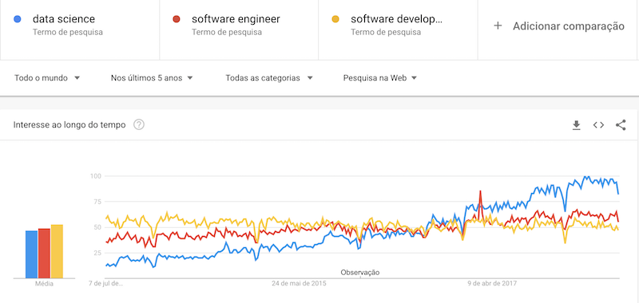
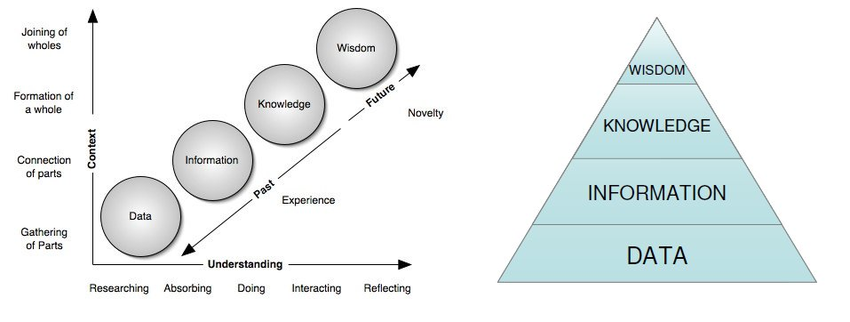
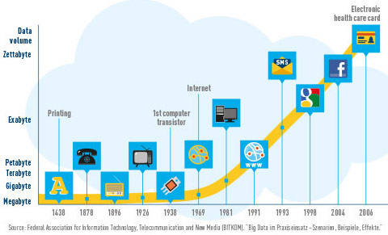
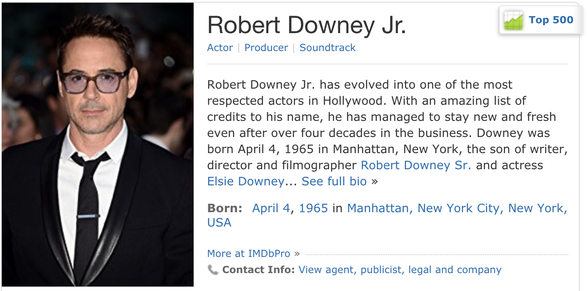
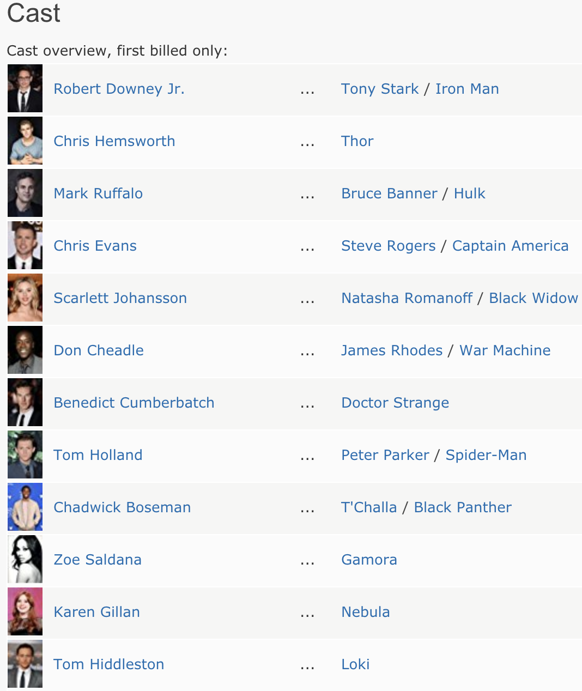

```{r setup, include=FALSE}
knitr::opts_chunk$set(echo = FALSE)

library(dplyr)
library(emo)
```

<style>
div.footnotes {
  position: absolute;
  bottom: 0;
  margin-bottom: 10px;
  width: 80%;
  font-size: 0.5em;
}
</style>

# Por que estudar análise de dados?

## Tendências de busca

<div align="center">

</div>

<div class=footnotes>
Fonte: [Google Trends](https://trends.google.com/trends/explore?date=today%205-y&q=data%20science,software%20engineering,software%20development)
</div>

## Dados $\to$ Informação $\to$ Conhecimento $\to$ Sabedoria

<div align="center">

</div>

<div class="footnotes">
Fonte: [The Application of Visual Analytics to Financial Stability Monitoring](https://www.researchgate.net/publication/272242493_The_Application_of_Visual_Analytics_to_Financial_Stability_Monitoring)
</div>

## Conhecimento é poder!

<div align="center">

</div>

## Quem tem interesse?

- Empresas querem insights para melhorar seus negócios

- Cidadãos querem mais transparência de dados e informação

- Governos querem mecanismos para melhorar fiscalização `r emo::ji("thinking")`


# Afinal, o que é *análise de dados*? E *ciência de dados*?

## O que é análise / ciência de dados?

- Como toda área nova, não há definições muito claras `r emo::ji("upset")`

Algumas definições relacionadas da [Gartner](https://www.gartner.com/it-glossary):

- **Business Inteligence (BI):** *Aplicações, ferramentas e melhores práticas que permitem o acesso e a análise de informações para melhorar e otimizar decisões e desempenho.*

> - **Analytics**: *Processo de analizar informações de um domínio particular. Ou a aplicação de BI para uma área específica.*

> - **Big data**: *Grande volume, velocidade e/ou variedade de dados que exigem processamento eficiente e inovador de informações permitindo insights, decisões e automação de processos.*

> - **Cientista de dados**: *Extrai insights de dados. Requer habilidades analíticas para detectar padrões.*


## Ciência de dados

Incorpora elementos de:

- Exploratory Data Analysis (EDA) e Visualização;
- Machine Learning e Estatística;
- Computação de Alto Desempenho

<div class="columns-2">

Habilidades necessárias:

- Ciência da Computação
- Matemática e Estatística
- Expertise nos domínios da aplicação

<div></div>
</div>

<div class='footnotes'>Fonte: [CSE 519: Data Science - Steven Skiena - Lecture 1: Introduction to Data Science ](http://www3.cs.stonybrook.edu/~skiena/data-manual/lectures/pdf/L1.pdf)</div>


## Por que ciência de dados agora? `r paste(ji("top"), ji("top"), ji("top"))`

> - Novas tecnologias possibilitam capturar e armazenar um grande volume de dados (redes sociais, logs, sensores)

> - Avanços computacionais permitem novas formas de analisar dados em larga escala (Cloud Computing, Machine Learning)

> - Sucesso de análises de dados em grandes empresas serviu de modelo para popularizar a ciência de dados (Google, Facebook, Amazon, predição em esportes, eleições)
> - <div align='center'></div>


## Apreciando dados

Cientistas da computação geralmente não apreciam dados

- É só algo que eles carregam nos programas
- Geralmente usam dados aleatórios para testar programas
- <span style="color:blue">Conjuntos de dados interessantes são recursos raros, que requerem trabalho duro e imaginação para obtê-los</span>

## Cientistas reais x da computação

<div class="columns-2">
**Cientistas reais**

- Se esforçam para entender a bagunça do mundo real
- Nada é completamente verdadeiro ou falso
- São direcionados a dados
- Obsessão por descobrir
- São acostumados a dados com erros

<br>

**Cientistas da computação**

- Constroem seu próprio mundo virtual organizado
- Tudo é completamente verdadeiro ou falso
- Direcionados a algoritmos
- Obsessão por inventar
- São acostumados com dados corretos
</div>

- <span style="color:red">Cientistas de dados devem aprender a pensar como cientistas reais!</span>


## Ciência tradicional x ciência de dados

- Ciência tradicional: formulação de hipóteses e obtenção de dados específicos para confirmá-las ou negá-las.

- Ciência de dados: geração de dados em larga escala para realizar novas descobertas ao analisá-los.

Duas formas importantes de pensar:

- Dado um problema, quais dados disponíveis ajudarão a resolvê-lo?
- Dado um conjunto de dados, que problemas interessantes se aplicarão a ele?


## Genialidade x Sabedoria

- Desenvolvedores são contratados para produzir código
- Cientistas de dados são contratados para produzir *insights*

- Genialidade é saber encontrar a resposta correta
- **Sabedoria é saber evitar as respostas erradas!**

- A ciência de dados se beneficia mais de sábios que de gênios

- A sabedoria vem de:
    - Experiência
    - Conhecimento geral
    - Ouvir os outros
    - Humildade: observar quanto, como e porque você errou


## Desenvolvendo a curiosidade

- O bom cientista de dados desenvolve curiosidade sobre o domínio / aplicação que ele está trabalhando

- Ele conversa com pessoas envolvidas nos dados que trabalha

- Ele acompanha notícias para ter uma visão ampla do mundo

- Ao contrário de desenvolvedores, eles são encorajados a perguntar:
    - Que coisas interessantes você consegue aprender de um certo conjunto de dados?
    - Que coisas você realmente quer saber?
    - Que conjunto de dados pode levar você a isso?


# Fazendo perguntas

## IMDb: dados de filmes e séries

<div align='center'><a href='https://www.imdb.com/title/tt4154756'></a></div>

## IMDb: dados de atores

<div class="columns-2">
<div align='left'><a href='https://www.imdb.com/name/nm0000375'></a></div>

<div align='right'><a href='https://www.imdb.com/title/tt4154756/fullcredits'></a></div>
</div>

## IMDb: Perguntas? [1/2]

>- Quais atores apareceram em mais filmes? Ganharam mais dinheiro? Apareceram nos piores filmes? Tiveram carreiras mais longas e mais curtas?

>- Qual o filme melhor avaliado a cada ano? E para cada gênero? Em quais filmes foi perdido mais dinheiro? Tiveram os elencos mais poderosos? Tiveram as piores avaliações?

>- É possível prever a nota de um filme? E o faturamento? Filmes com maior faturamento possuem as maiores notas e ganham mais prêmios?

>- Como os filmes de Hollywood se comparam a filmes indianos em termos de: avaliações, orçamento, rendimento? Filmes americanos são mais bem avaliados do que estrangeiros?


## IMDb: Perguntas? [2/2] {.build}

- Como é a rede "social" da participação de atores em filmes?
    - Exemplo: [grafo que indica graus a partir de Kevin Bacon](https://oracleofbacon.org)

- Qual é a distribuição de idade de atores e atrizes em filmes? Atrizes tendem a ser mais jovens que atores?

- Quais gêneros de filmes recebem as melhores avaliações? Quais gêneros são mais caros? Quais faturam mais?

- Qual a probabilidade de uma pessoa gostar de um filme? (Exemplo: recomendações do Netflix)

## Referências

- Skiena S.S. (2017) [What is Data Science?](https://link.springer.com/chapter/10.1007%2F978-3-319-55444-0_1). In: The Data Science Design Manual. Texts in Computer Science. Springer.
    - CSE 519: Data Science - Steven Skiena - [Lecture 1: Introduction to Data Science ](http://www3.cs.stonybrook.edu/~skiena/data-manual/lectures/pdf/L1.pdf)
